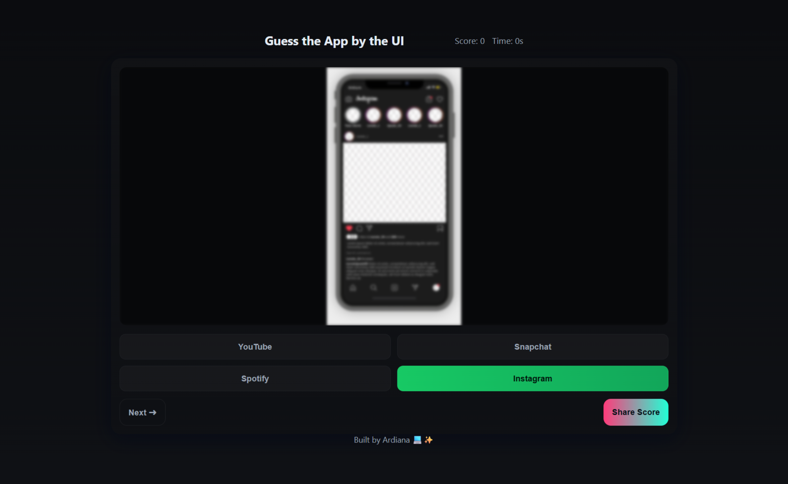

# Guess the App by the UI 🎮📱

Test your knowledge of popular apps! Can you recognize Instagram, TikTok, Spotify, YouTube, Snapchat, and Netflix just by looking at a blurred version of their UI?

This is a fun, fast-paced browser game with a timer, score, and daily challenges.

## Features

- Blurred app UIs that gradually become clearer
- Timer for each question
- Score tracking
- Multiple choice answers
- Daily challenge mode (optional)
- Mobile-friendly responsive design

## How to Play

1. Click **Start** to begin the game.
2. Look at the blurred app screen.
3. Select the app you think it is from the options.
4. Score points for correct answers before time runs out!
5. Try to get all correct to prove you’re a UI master 😎

## Demo

You can play it live here: (https://gummysnarl.itch.io/guessapp)

## Screenshots

[App Score](assets/GuessAppScore.png)

## Contributing

Feel free to open an issue or submit a pull request to add more apps or features!

## License

MIT License
